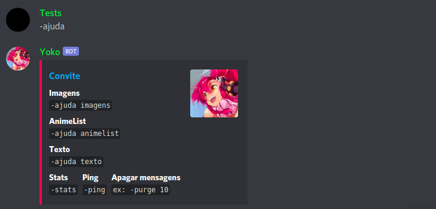

# Yoko - A discord bot in Python
Prefix: **-**

### **Commands**
```Terminal
-ajuda -> show the commands available
-ping -> ping

-purge *number* (Delete a number of messages)

-tojpg -> (Convert upload image JPG to PNG)
-topng -> (Convert upload image PNG to JPG)

-trad *language* *text* -> (Translates the text into the informed language)

-tojpg -> (Convert upload image JPG to PNG)
-topng -> (Convert upload image PNG to JPG)

-trad *language* *text* -> (Translates the text into the informed language)

-anilist *nameUser* anime -> (Random anime from the user's PTW list)
-anilist *nameUser* manga -> (Random manga from the user's PTR list)
```
| Example  |
| --- |
|    |


### How to run
Download project
```terminal
git clone https://github.com/AlfredoFilho/Yoko
cd Yoko/
```
Install requirements
```terminal
pip3 install -r requirements.txt
```
Add your [Token Discord Bot](https://discord.com/developers/applications/) in file Yoko.py line 230
```terminal
TOKEN = 'yourTokenBot'
```

Start
```terminal
./start
```
Or
```terminal
python3 Yoko.py
```

If works, in terminal will appear "Online"<br /><br />
To add on a server, open the url in browser (replace CLIENTID with your [client id apllication](https://discord.com/developers/applications/))
```Terminal
https://discordapp.com/oauth2/authorize?client_id=CLIENTID&scope=bot&permissions=125952
```
